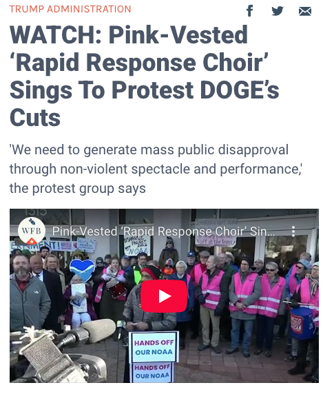

theme: Titillium, 1
slide-transition: true
slide-transition: fade(0.2)
slidenumbers: true
autoscale: true
footer: @rapidresponsechoir PMN Winter Convergence 2026

# Rapid Response Choir

## Vision and Mission

The Rapid Response Choir sings for truth, justice, and democracy – we stand against threats to the Constitution and our community....

When authoritarian forces seek to harm our neighbors and community, the Rapid Response Choir will be there to sing truth to power.

^
The literal vision for the RRC came to me on Sunday morning, Jan
26, 2025. I was serving as Door Guardian for a majority immigrant
church, with my cheat sheet for how to respond should "La Migra"
show up.  In putting together our Door Guardian practices, we knew
eventually we should build out a rapid response network of: witnesses,
political actors, & media.

^
As I sat through service in the lobby, I mused on the notion of "Rapid 
Response", and I had a vision of am impassioned choir from the local 
churches marching down singing upon the ICE agents, calling them 
to task, and supporting our beleaguered neighbors. Wouldn't it be amazing,
I pondered, if we had a Rapid Response Choir. Which would: 

---

# Rapid Response Choir - 2025

* First practice on February 4
* First public appearance (right ➡️)  March 3
* Forty subsequent events in 2025 – small and large
* One event _per day_ in 2026 (through 1/13)
* Four chapters (DC, Baltimore, N. Virginia, Massachusetts)

^
Cue Montage: - Announcing at CP Chorale, Practicing in a basement,
then in a church, Learning songs from YouTube, Creating a website, Ordering Vests, and Recruiting.

^
When I heard on a Friday that there'd be a rally for climate scientists
at NOAA nearby, I reached the organizers: Hey want some songs?

^
From there, we've gone on supporting 40 events in 2025, to 13 events in the first 2 two weeks of 2026! We have chapters in NE DC, N. Virginia, Baltimore, and central Massachusetts.

Here we are in action on Oct 18 @ No Kings Two:

---

# No Kings 2

^
from 0:20 to 1:20

---
[.build-lists: true]

# How we've scaled

* Song leaders
* Effective use of Signal + Email + Web
* Pink vests

^
We've been learning as we go, in retrospect, some keys have been:

---

# Song leaders

* No one person leads all the songs
* Practices are as much about song leading as singing
* We find safe places for novice song leaders
  * Try your local Indivisible chapter
* A choral quorum (6) means you have backup

---

# Using web/mail/Signal

* Web site - public
  * Songs / Events + QR code / Chapters (coming soon)
* Mailing list - restricted
  * Internal wiki
* Signal groups - vetted
  * Song leaders group
  * Entire choir (noisy!)
  * Event-specific

---

# Pink vests 🦺

* Boosts courage
* Supports safety (pack in/pack out)
* Lends authority
* Enhances media presence
  * Which helps the event 
  * and grows the choir

^Image - Me and the first vest

^Unlike Tshirts, easy to don, and doff
We're provided a backdrop for press conference
Makes it a lot easier to get the attention of an event coordinator,
eg. at the Venezuela protest.

---

# How an Event Unfolds

* Inquiry, or a choir member pitches an event
* After :thumbsup: x 3, a new Signal group
* Email sent out to amplify, if time allows
* Web page with a song list
* Coordination on event-specific Signal
* Muster 30-40 minutes early and: Sing!
* Be good guests of the organizers

^
* Lots of people to help with:
  * formatting, printing song sheets
  * off site safety coordinators
  * and more...
So... We've and others have done all these events, what
good has come of it?

---

# Outcomes

* **Kilmar Ábrego García is home**
* Avelo Airlines is ceasing DHS flights
* Shuttered DC Target during small-biz Saturday (DCLC)
* Reclaimed one parking lot from ICE (DCLC)

---

^ https://www.bbc.com/news/articles/cx2ny7yl097o

---

# Kilmar Ábrego García

* March: "Mistakenly" detained and deported to CECOT
* Family sued, with support from CASA Maryland
* Greenbelt federal courthouse is in our backyard
* We coordinated with CASA to come and sing

---

# Kilmar, cont:

1. We provided solace to the family
2. “Anger motivates, music sustains”
3. One element to keep media focus on the case
4. Politicians saw an opportunity ...
5. ... Kilmar is home with his family

^Political actors like Sen. Chris Van Hollen got involved
because they sensed a political opportunity that would not
have appealed to them had the community sat on their hands

^So we kept showing up, hearing after hearing, rain & heat, and
now Kilmar is home his family.

---

# Outcomes

* Kilmar Ábrego García is home
* Avelo Airlines is ceasing DHS flights
* Shuttered DC Target during small-biz Saturday (DCLC)
* **Reclaimed one parking lot from ICE (DCLC)**

---

## Reclaiming our Neighborhood

---

# Reclaiming _America the Beautiful_

* _please hum, or "oooh"_

^
Kevin a D please

^Patriotic songs are our songs. We celebrate not just beauty of
America, but our heroes. Yes, those who served in uniform, but all
who had the courage to stand for justice and freedom.  The
self-emancipated, the abolitionists, the unionizers, the freedom
riders, the AIDS activists, and the queer who live authentic lives
with pride. These are our heros who make America beautiful

---

## _America the Beautiful_

[.column]
O beautiful thy immigrants
Who hail from every land
Their hope and heart and diligence
Like gifts from god’s own hand
America! America!
Thy grace shall yet remain
To greet the poor who reach thy shore
With open arms again

_(– Jesse Palidofsky)_

[.column] 
O beautiful for heroes proved
In liberating strife,
Who more than self their country loved
And mercy more than life!
America! America!
May God thy gold refine
Till all success be nobleness
And every gain divine!

_(– Katherine Lee Bates)_

---

# Other Benefits

* Keeps people coming back
* Tactics for safety & variety
  * “Buttons” between speakers
  * “Mic check” for safety
* De-escalating conflict
  * This one flummoxes some folks, so

^
- We need people showing up and coming back
- Break up the monotony of speaker after speaker
- Safety announcements 
- NoVa J6 vigil: Speakers getting heckled
- Heckler gets quiet for "This Little Light"
- Heckler joins for America the B
- The de-conflicting aspects scares the RW

---

# Right wing media _loathes_ us

^This is a good thing. They don't know how to respond

---

---

# Effecting Regime Change 🇺🇸

* 3.5% engaged in active non-resistance
  * = 9.1 million adults
* Music is key to any movement
* If 1:500 of those people sing
  * = 45,000 singers

That's a lot of pink vests :smile:

^Examples: Civil rights, S.Africa, Estonia

---

# [fit]Let’s Do This

---

# Discussion Points

* Diversity and engagement
* Networking with allies
* Lessons from MN elsewhere
* Tactical challenges
* Safety, privacy, and security
* Comms (Web / email / Signal)
* Real-time rapid response (:lightbulb: don't)