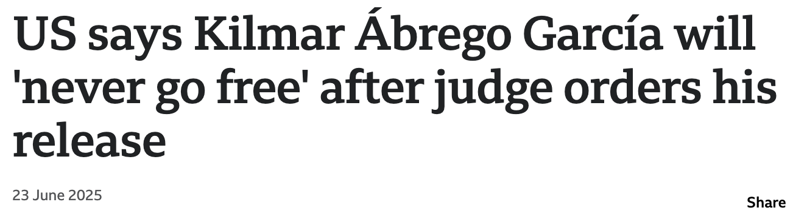
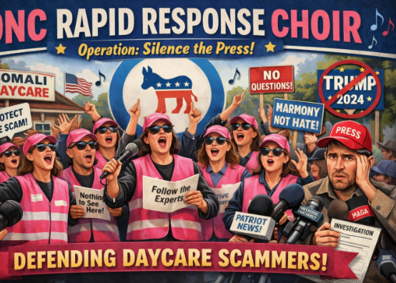
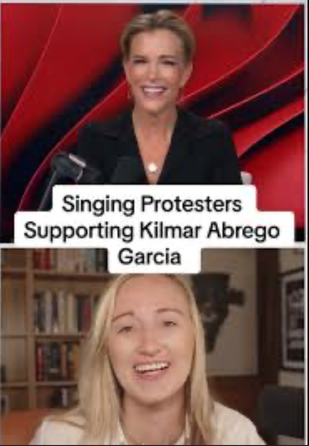
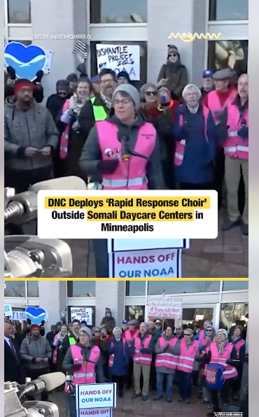
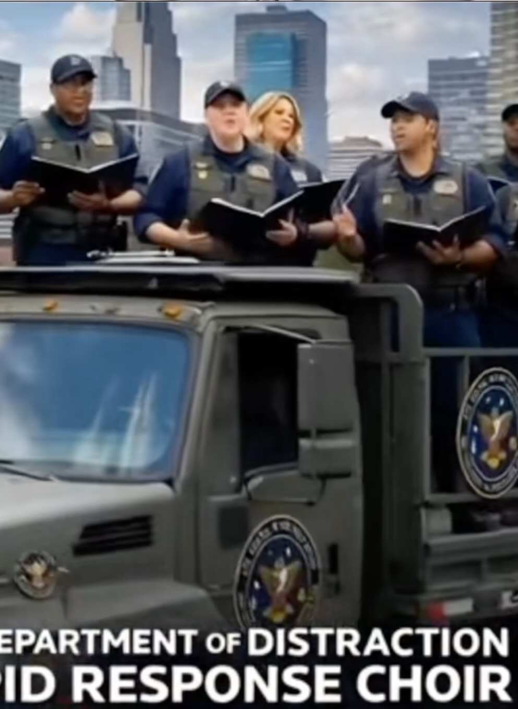

theme: Titillium, 1
slide-transition: true
slide-transition: fade(0.2)
slidenumbers: true
autoscale: true
footer: @rapidresponsechoir PMN 2026

# Rapid Response Choir

## Vision and Mission

The Rapid Response Choir sings for truth, justice, and democracy – we stand against threats to the Constitution and our community....

When authoritarian forces seek to harm our neighbors and community, the Rapid Response Choir will be there to sing truth to power.

^
The literal vision for the RRC came to me on Sunday morning, 
Jan 26, 2025. I was serving as Door Guardian for a majority immigrant 
church, with my cheat sheet for how to respond should "La Migra" show up. 
In putting together our Door Guardian practices, we knew eventually we should build
out a rapid response network of: witnesses, political actors, & media.

^
As I sat through service in the lobby, I mused on the notion of "Rapid 
Response", and I had a vision of am impassioned choir from the local 
churches marching down singing upon the ICE agents, calling them 
to task, and supporting our beleaguered neighbors. Wouldn't it be amazing,
I pondered, if we had a Rapid Response Choir. Which would: 

---

# Rapid Response Choir - 2025

* First practice on February 4
* First public appearance March 3
* 40 subsequent events in 2025
* One event _per day_ in 2026 (through 1/13)
* Four chapters (DC, Baltimore, N. Virginia, Massachusetts)

^
TRIM THIS - You get it going and it starts.

^
So the RRC was born. I took that idea, published a Google Doc, and
announced it at College Park Chorale practice on groundhog Day "Hey - what the world needs is rapid
response choir! If you're game, see me at break. About 1/5th of the choir 
were in for this.

^We started practicing in my basement, working from YouTube, doing outreach,
getting a domain and website and mailing list, ordering 
pink vests and by March we were raring to go.

^I  had some contacts with a local climate action network, and offered to provide song leading for a rally to support NOAA scientist (just down the road from us) and from there we've grown to... Supporting 40 events in 2025, to 13 events in the first 2 two weeks of 2026! We have chapters in NE DC, N. Virginia, Baltimore, and central Massachusetts.

Here we are in action on Oct 18 @ No Kings Two:

---

# No Kings 2

^
from 0:20 to 1:20

---

# How we've scaled

* Song leaders
* Colorful vests
* Effective use of Signal + Email + Web

^
Now, not all our events have the same lead time. They've been as 
small as 5 of us for elementary school, to fund raisers, to court hearings
to solidarity events for the transgender community. Sometimes we're invited,
sometimes we just show up early, start singing, and see how we can help 
the event organizers.

^I'm not at most events. We've leaned on training up song leaders,
making a visual and musical impact, and using modern tools for organizing.

---

# Song leaders

* No one person has to lead all the songs
* Practices are as much about song leading as singing
* We find safe places for novice song leader
* A choral quorum (6) means you have backup

---

# Colorful vests

* Boosts courage
* Enhances Safety (pack in/pack out)
* Provides a visual element for organizers
* Lends authority

^Image - Me and the first vest

^Unlike Tshirts, easy to don, and doff
We're provided a backdrop for press conference
Makes it a lot easier to get the attention of an event coordinator,
eg. at the Venezuela protets.

---

# How we use web/mail/Signal

* Web site - public
  * Songs / Events + QR code / Chapters (coming soon)
* Mailing list - restricted
* Signal groups - vetted
  * Song leaders group
  * Entire choir (noisy!)
  * Event-specific

---

# How an Event Unfolds

* Inquiry, or a choir member pitches an event
* After :thumbsup: x 3, a new Signal group
* Email sent out to amplify, if time allows
* Web page with a song list
* Coordination on event-specific Signal
* Muster 30-40 minutes early and: Sing!
* Be good guests of the organizers

^
* Lots of people to help with:
  * formatting, printing song sheets
  * off site safety coordinators
  * and more...
So... We've and others have done all these events, what
good has come of it?

---

# Outcomes

* **Kilmar Ábrego García is home**
* Avelo Airlines is ceasing DHS flights
* Shuttered DC Target during small-biz Saturday (DCLC)
* Reclaimed one parking lot from ICE (DCLC)

---

^ https://www.bbc.com/news/articles/cx2ny7yl097o

---

# Kilmar

* March: "Mistakenly" detained and deported to CECOT
* Family sued, with support from CASA Maryland
* Greenbelt federal courthouse is in our backyard
* We coordinated with CASA to come and sing

---

# Kilmar, cont:

1. We provided solace to the family
2. “Anger motivates, music sustains”
3. We kept the media focus on the case
4. Politicians saw an opportunity ...
5. ... Kilmar is home with his family

^Political actors like Sen. Chris Van Hollen got involved
because they sensed a political opportunity that would not
have appealed to them had the community sat on their hands

^So we kept showing up, hearing after hearing, rain & heat, and
now Kilmar is home his family.

---

# Outcomes

* **Kilmar Ábrego García is home**
* Avelo Airlines is ceasing DHS flights
* Shuttered DC Target during small-biz Saturday (DCLC)
* Reclaimed one parking lot from ICE (DCLC)

---

## Taking Back our Neighborhood

---

# Reclaiming Songs

## America the Beautiful

O beautiful for spacious skies,
For amber waves of grain,
For purple mountain majesties
Above the fruited plain!
America! America!
God shed his grace on thee
And crown thy good with brotherhood
From sea to shining sea!

_Hummm...._

---

Humm this only, then do the Immigratnsverse for time.

^Patriotic songs are our songs. We celebrate
not just beauty of America, but our heroes. Yes,
those who served in uniform, but all who had the courage to stand for justice and freedom.
The self-emancipated, the abolitionists, the unionizers, the freedom riders, 
the AIDS activists, and the queer who live authentic lives with pride. These are who make America beautiful

## America the Beautiful

[.column] 
O beautiful for heroes proved
In liberating strife,
Who more than self their country loved
And mercy more than life!
America! America!
May God thy gold refine
Till all success be nobleness
And every gain divine!

_(– Katherine Lee Bates)_

[.column]
O beautiful thy immigrants
Who hail from every land
Their hope and heart and diligence
Like gifts from god’s own hand
America! America!
Thy grace shall yet remain
To greet the poor who reach thy shore
With open arms again

_(– Jesse Palidofsky)_

---

# Other Benefits

* Motivates continuing on
* Event tactics
  * “Buttons” between speakers
  * “Mic check” for safety
* De-escalating conflict

^
- We need people showing up and coming back
- Break up the monotony of speaker after speaker
- Safety announcements 
- NoVa J6 vigil: Speakers getting heckled
- Heckler gets quiet for "This Little Light"
- Heckler joins for America the B
- The de-conflicting aspects scares the RW

---

# Right wing media _loathes_ us

^This is a good thing. They don't know how to respond

---

---

# Effecting Regime Change 🇺🇸

* 3.5% engaged in active non-resistance
  * = 9.1 million adults
* Music is key to any movement
* If 1:500 of those people sing
  * = 45,000 singers

That's a lot of pink vests :smile:

^Examples: Civil rights, S.Africa, Estonia

---

# [fit]Let’s Do This

---

# Discussion Points

* Diversity and engagement
* Networking with allies
* Lessons from MN elsewhere
* Tactical challenges
* Safety, privacy, and security
* Comms (Web / email / Signal)
* Real-time rapid response (:lightbulb: don't)